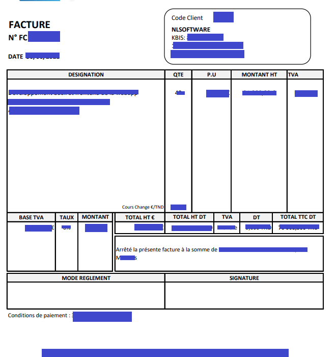
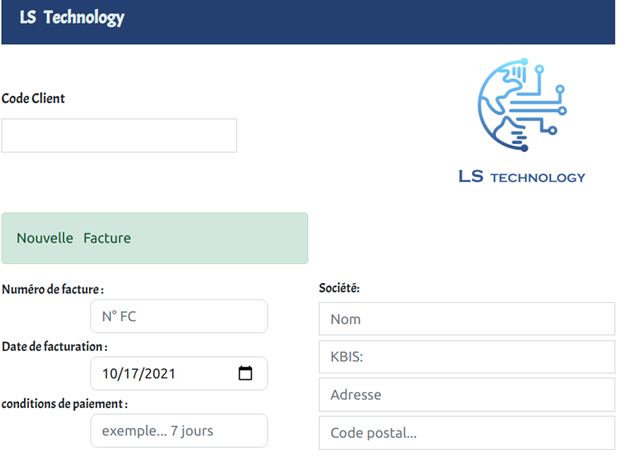
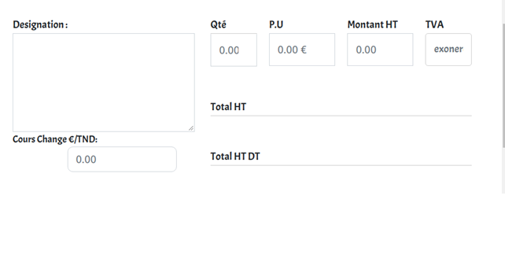
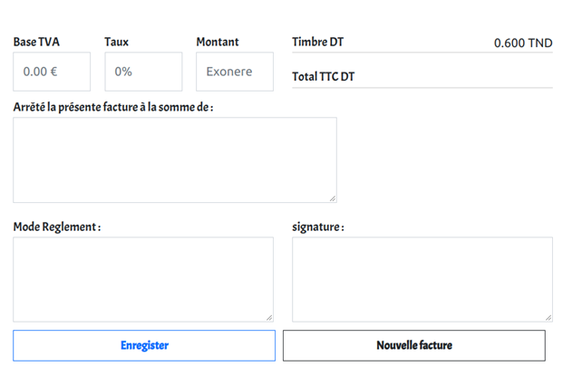
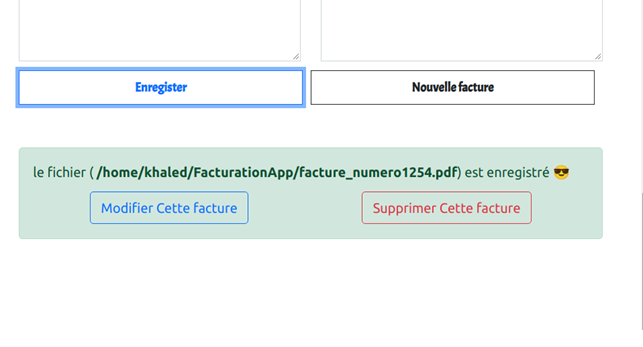
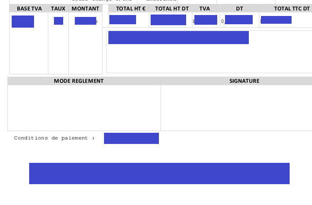
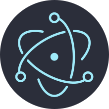

# invoicing software
## The goal of this project is to automate the generation of invoices in Ls-technology in the following format : 




### By filling in the following formula, a calculation of all the fields of the invoice will be performed and a PDF file will be generated automatically. 





### success of the operation



### Update an invoice


### example of the invoice generated by the application





A basic Electron application needs just these files:

- `package.json` - Points to the app's main file and lists its details and dependencies.
- `main.js` - Starts the app and creates a browser window to render HTML. This is the app's **main process**.
- `index.html` - A web page to render. This is the app's **renderer process**.

You can learn more about each of these components within the [Quick Start Guide](https://electronjs.org/docs/latest/tutorial/quick-start).

## To Use

To clone and run this repository you'll need [Git](https://git-scm.com) and [Node.js](https://nodejs.org/en/download/) (which comes with [npm](http://npmjs.com)) installed on your computer. From your command line:

```bash
# Clone this repository
git clone https://github.com/khaled-bougrine/Khaled_internship_project/
# Go into the repository
cd electron-quick-start
# Install dependencies
npm install
# Run the app
npm start
```


Note: If you're using Linux Bash for Windows, [see this guide](https://www.howtogeek.com/261575/how-to-run-graphical-linux-desktop-applications-from-windows-10s-bash-shell/) or use `node` from the command prompt.

## Resources for Learning Electron

- [electronjs.org/docs](https://electronjs.org/docs) - all of Electron's documentation
- [electronjs.org/community#boilerplates](https://electronjs.org/community#boilerplates) - sample starter apps created by the community
- [electron/electron-quick-start](https://github.com/electron/electron-quick-start) - a very basic starter Electron app
- [hokein/electron-sample-apps](https://github.com/hokein/electron-sample-apps) - small demo apps for the various Electron APIs


##  technology used in this project

### NodeJs

Node.js is an open source software platform in JavaScript, oriented towards highly concurrent event-driven network applications that need to be able to scale. 


### Electron Js

Electron is an environment for developing cross-platform desktop applications with web technologies. The infrastructure is coded in node.js, and the interface is built on Chromium tools, the open source part of Google Chrome.




### pdf-lib
pdf-lib was created to address the JavaScript ecosystem's lack of robust support for PDF manipulation (especially for PDF modification).


