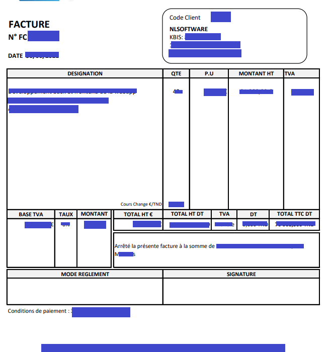
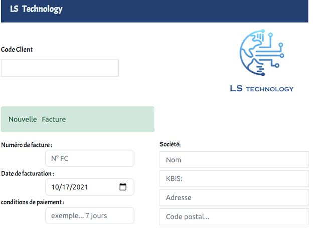
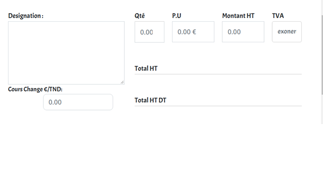
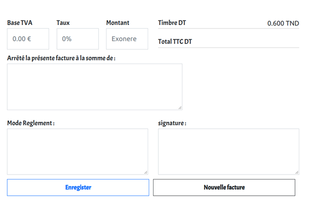
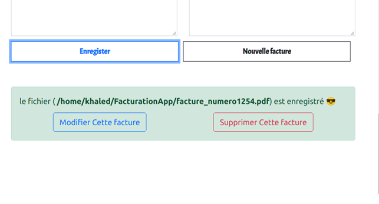
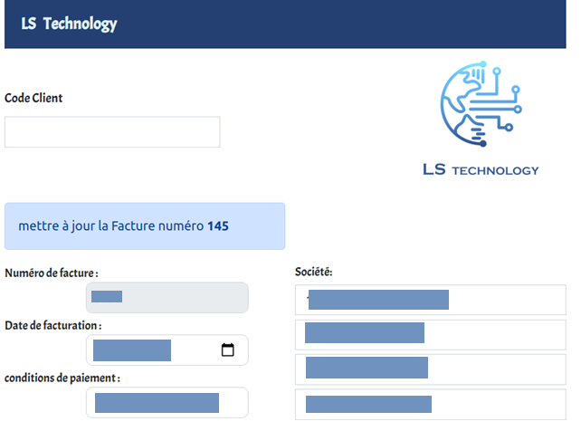
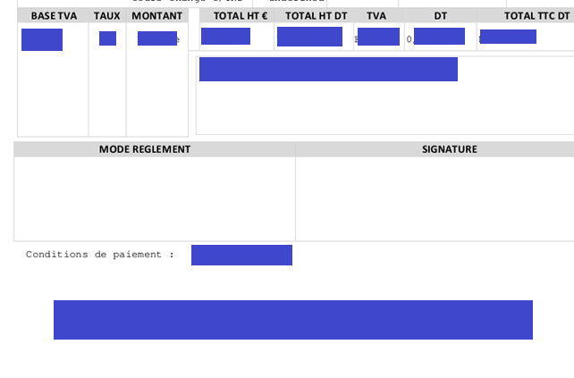

## The goal of this project is to automate the generation of invoices in Ls-technology in the following format : 

### By filling in the following formula, a calculation of all the fields of the invoice will be performed and a PDF file will be generated automatically. 

### success of the operation

### Update an invoice

### example of the invoice generated by the application

##  technology used in this project

### NodeJs

Node.js is an open source software platform in JavaScript, oriented towards highly concurrent event-driven network applications that need to be able to scale. 

### Electron Js

Electron is an environment for developing cross-platform desktop applications with web technologies. The infrastructure is coded in node.js, and the interface is built on Chromium tools, the open source part of Google Chrome.

### pdf-lib
pdf-lib was created to address the JavaScript ecosystem's lack of robust support for PDF manipulation (especially for PDF modification).

